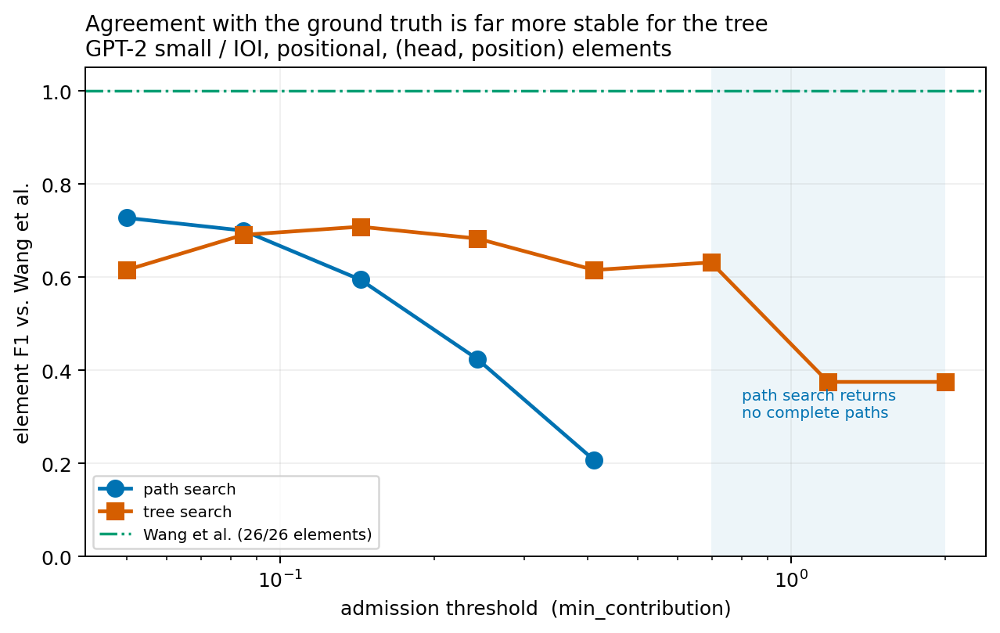
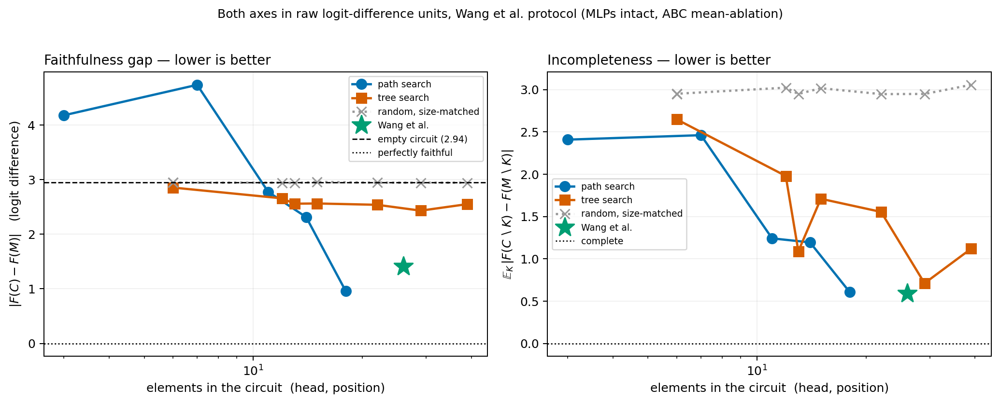
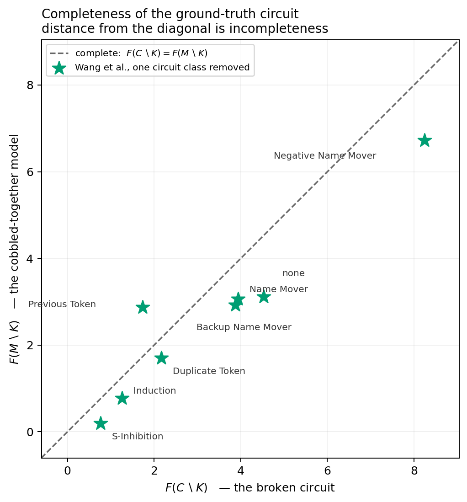

# The Tree Extension of IPE

This document is the reference description of the tree-based circuit search
(`TreeMessagePatching`): why the extension exists, the formalism it operates in, the two scoring
rules it supports, the properties each one has, and how the resulting circuits are evaluated. It is
written to be read on its own and is the source material for the tree-extension chapter.

Code: `src/ipe/paths.py`, `src/ipe/graph_search.py`, the comparison driver
`experiments/tree_vs_path.py`, the evaluation notebook
`experiments/faithfulness_completeness_v2.ipynb`, and the interactive demo under `visualization/`.

> **A note on units.** Two evaluation conventions appear in this document and they are *not*
> interchangeable.
>
> * **v2 / Wang parity** (Sections 5–6, all figures) — positional `(head, position)` circuits, MLPs
>   never ablated, raw logit differences with no normalisation. This is the protocol of Wang et al.
>   (2023), verified against their code, and it is what the results chapter reports.
> * **v1 / strict knockout** (Sections 4.4–4.5) — non-positional component circuits with *everything*
>   outside the circuit ablated, MLPs included, scores normalised so `1.0` is the full model and
>   `0.0` the empty circuit. This is the convention MIB's CPR/CMD uses, and it is the convention the
>   joint-scoring diagnosis was measured in.
>
> Every number below is tagged with the convention that produced it. Numbers from the two are never
> compared directly.

Appendix A records the development history, including two design decisions that were later found to
be wrong and the corrections that replaced them.

---

## 1. Motivation

### 1.1 A set of paths cannot represent self-repair

`PathMessagePatching` returns a circuit as a *set of independent root-to-embedding paths*
`[EMBED, …, FINAL]`, each scored by its own isolated effect. That representation has a structural
limit, and it is the reason for this extension.

In the message formalism of Section 2, a node plays one of two roles: a **leaf** is *being ablated*
and its message is frozen, while an **internal** node is *reacting* — its message is how its own
output changes when its children's contributions are removed from its input. Compensation between
components is therefore carried **only by internal nodes**.

In a set of root-to-output paths every component of interest is a leaf on its own path. Such a
structure can say "A matters" and "B matters", but it cannot express *"A's effect, as modified by
B"*, because that requires B to sit **above** A on a shared branch. A trie can express it; a path set
cannot.

This is not hypothetical. Section 4.6 measures it directly on the IOI name movers and their backups
(gpt2-small, v1 conventions, `logit_difference`, counterfactual denoising):

| topology | `𝔽` |
|---|---|
| name movers `A` as direct children of FINAL (flat, the path-set view) | +9.526 |
| `A` direct **plus** `FINAL ← backup_i ← A` for all 14 layer-legal routing edges | **+6.993** |
| **difference** | **−2.533 (−27%)** |

Accounting for the fact that removing the name movers *changes what the backups output* cancels 27%
of the damage. That is self-repair, measured inside the formalism — and it is invisible to a flat
topology, where the same two sets are additive to within 0.4%.

Self-repair is not a curiosity. It is exactly the phenomenon **completeness** is defined around
(Section 5.2): a circuit is incomplete when components *outside* it compensate for removals from it.
A representation that cannot express compensation cannot be diagnosed for it.

### 1.2 Why a trie, specifically

Given that the circuit should be a graph, the trie is the cheapest graph that solves the problem.
Many of the path search's paths share long suffixes toward the root — hundreds may end in
`… → A9H9 → FINAL` — and the path search re-derives each such suffix from scratch. Growing a single
tree rooted at FINAL shares those suffixes, gives every node one explicit parent, and makes the
per-candidate scoring cost `O(depth)` rather than `O(|T|)` (Section 3.8).

It also removes a practical failure mode of the path search: a path only enters the output if it
**reaches the embeddings**. Frontier nodes that never complete a path are discarded. At a high
threshold this means the path search returns *nothing at all* while the tree still returns a usable
circuit — measured in Section 6.4.

### 1.3 Why this makes the method comparable to the literature

ACDC (Conmy et al., 2023) and the MIB benchmark both operate on and evaluate **edge-level** circuits.
A set of independent root-to-output paths is not directly comparable to either. A trie is a graph
with named parents, so it converts to the same object those methods produce, which is what makes the
side-by-side comparison of Section 7 possible at all.

### 1.4 Two separable questions

The extension raises two questions, and the implementation deliberately keeps them separate:

1. **Representation.** Can the search grow a single tree rooted at FINAL that shares suffixes, turning
   a redundant path set into a trie with one explicit parent per node?
2. **Objective.** Once a tree exists, can a candidate be scored *in the context of the branches
   already admitted* rather than in isolation — and does that find a different circuit?

The tree is always a trie; the scoring rule is a flag (`joint_scoring`). Section 4.1 shows that under
isolated scoring the answer to (2) is "no by construction" — the tree is then exactly the path set,
re-materialised — which is what makes the path-vs-tree comparison well-posed.

---

## 2. Preliminaries: message passing over the computational graph

### 2.1 Nodes are difference operators

Every `Node` implements `forward` as a map from *a perturbation at the component's input* to *the
perturbation it induces at the component's output*, not as a function of activations. For an MLP:

```python
residual = msg_cache[input_name] - message          # perturb the input
residual = ln2(residual)
return  msg_cache[output_name] - mlp.forward(residual)   # the resulting change at the output
```

Write this operator `Δ_out = f_v(Δ_in)`. Called with `message=None` a node emits its own signal:
`out_clean − out_cf` under counterfactual patching, `out_clean` under zero patching.

### 2.2 Paths

`evaluate_path([n_k, …, n_1, root])` composes the operators down the chain and applies the metric to
the final residual with the accumulated message removed:

```
m_k = f_{n_k}(None),   m_{i} = f_{n_i}(m_{i+1}),   score = metric( root.forward() − m_root )
```

### 2.3 Trees

`get_tree_msg` generalises this by **summing the children's messages at a node's input and pushing
them through `f_v` once, jointly**:

```python
incoming = sum(get_tree_msg(child) for child in node.children)
return node.forward(message=incoming)
```

`evaluate_tree(root, metric) = metric(root.forward() − get_tree_msg(root))`, written `𝔽(T)` below. A
childless node emits `forward(None)`, so a single-child chain reduces exactly to `evaluate_path` —
an invariant `experiments/tree_vs_path.py::check_invariant` asserts at the start of every run, using
the run's own caches and patch configuration.

**A node plays one of two roles depending on where it sits, and that distinction carries most of the
semantics of the method:**

| position | message | meaning |
|---|---|---|
| **leaf** | `f_v(None)` | the node is *being ablated*. Its message is its own clean-minus-counterfactual output, read from the caches — **frozen**, and unaffected by anything else in the tree. |
| **internal** | `f_v(incoming)` | the node is *reacting*. Its message is how its own output changes when its children's contributions are removed from its input. |

An ablation's downstream consequences are therefore represented **only through internal nodes**. This
is what makes `evaluate_tree` a *path-restricted* ablation — path patching, and the point of the
method — rather than a full knockout in which every component in the model reacts at once. It is also
the fact Section 1.1 rests on. Section 4.6 measures what the restriction does and does not cost.

### 2.4 The non-additivity everything rests on

`f_v` is **not linear**, for three independent reasons: LayerNorm (`ln1`/`ln2`) rescales by the norm
of the *perturbed* residual; the MLP is nonlinear; and an attention head whose query or key stream is
patched recomputes its pattern. Therefore, for two children `a, b` of a node `v`:

$$ f_v(m_a + m_b) \;\neq\; f_v(m_a) + f_v(m_b). $$

Every difference between the two scoring rules of Section 3 is a consequence of this inequality. Note
that the *root* is an exception: `FINAL_Node.forward` returns its message unchanged, so branches that
meet only at the output interact solely through the LayerNorm inside the metric. Section 4.3 shows
this makes their interaction small, and that the real interaction happens at shared *internal* nodes.

### 2.5 Two boundary facts

**Empty tree scores zero.** `evaluate_tree` on a childless root uses `message = 0` (not
`forward(None)` — see Appendix A.2), so `𝔽(∅) = metric(root.forward())`. The metric is calibrated so
that the unperturbed residual scores zero: `ExperimentManager.load_metric` computes `baseline_value`
from precisely the cache the root reads back. Hence **`𝔽(∅) = 0` exactly**.

**A node's children saturate at the node itself.** Under counterfactual patching, if `S` is the set
of *all* of `L`'s predecessors then `Σ_{c∈S} m_c = in_L^{clean} − in_L^{cf}`, so

$$ f_L\Big(\sum_{c \in S} m_c\Big) = out^{clean}_L - L\big(in^{cf}_L\big) = out^{clean}_L - out^{cf}_L = f_L(\text{None}). $$

Growing the tree beneath `L` therefore *interpolates* from "ablate `L` wholesale" (no children) down
to "ablate only what the admitted children explain". This is the fact that makes the naive marginal
definition ill-posed (Section 3.3).

---

## 3. The search

### 3.1 Backwards breadth-first growth

`TreeMessagePatching` starts from the root and grows the tree level by level. At each depth every
frontier leaf `L` enumerates its predecessors (`get_expansion_candidates`), each candidate `C` is
scored, and the admitted ones are attached as children of `L`. Non-embedding admissions form the next
frontier. A leaf whose candidates all fail simply stops growing, and survives as a truncated branch.

### 3.2 Scoring rule A — isolated branch contribution (`joint_scoring=False`, default)

$$ \mathrm{score}(C) \;=\; \texttt{evaluate\_path}\big([C, L, \ldots, \mathrm{root}]\big) $$

The candidate's message travels to the root alone; every intermediate node sees only that one
message. The score depends on the chain and nothing else — not on siblings, not on any other branch,
not on the threshold. This is exactly the per-path score `PathMessagePatching` uses.

### 3.3 Scoring rule B — joint, in-context contribution (`joint_scoring=True`)

$$ \mathrm{score}(C) \;=\; \mathbb{F}\big(T \text{ with } L \text{ emitting } f_L(m_C)\big) \;-\; \mathbb{F}\big(T \text{ with } L \text{ emitting } 0\big), $$

with `m_C = f_C(None)` and every other branch of `T` frozen. The candidate's message now merges with
the other subtrees' messages at every shared ancestor and at the metric.

**On the choice of baseline.** The natural-looking definition `𝔽(T ⊕ C) − 𝔽(T)` — the discrete
derivative of the tree's score with respect to attaching one edge — is *wrong here*, and was the
original v1 rule (Appendix A.1). By the saturation fact of Section 2.5, attaching a child to `L`
does not add signal to the tree: it *narrows* an ablation, replacing `f_L(None)` by the strictly
smaller `f_L(m_C)`. That difference is positive only at depth 0 (where attaching to the empty root
genuinely adds mass) and **systematically negative afterwards**, so it is not comparable across
depths and cannot drive a single threshold.

Taking "`L` contributes nothing" as the baseline instead fixes this. The resulting score keeps the
isolated rule's sign convention and scale, and because `𝔽(∅) = 0` it reduces **exactly** to
`evaluate_path([C, root])` at depth 0, where the tree is still empty. The two rules therefore agree
on the first level and diverge only once there is a context to be in.

### 3.4 Simultaneity within a depth

Joint scores depend on what is already in `T`, so the BFS must say what `T` is while a depth is being
scored. Three options:

| policy | order-independent | penalises redundancy | cost |
|---|---|---|---|
| **simultaneous** (implemented) | yes | no, *by design* | 1× |
| sequential (attach as you go) | no | yes | 1× |
| greedy re-rank (attach best, re-score, repeat) | yes | yes | k× |

The implementation **freezes `T` for the whole depth** (`_joint_scoring_context`): every candidate at
a depth is scored against a context containing none of its same-depth peers, and admitted nodes are
attached against that same frozen snapshot.

This is a deliberate choice against redundancy pruning. Completeness (Section 5.2) is *defined* as the
absence of components outside the circuit that compensate for removals from it — on IOI, precisely
the backup name movers. A greedy re-ranking rule would reject a backup head as soon as the head it
backs up is admitted, buying minimality at the direct cost of the property being measured. Under
simultaneous scoring two candidates carrying the same signal are both admitted, which is the wanted
behaviour. (The order-independent way to get a redundancy penalty is to average marginals over
orderings — a Shapley value — which is not affordable at this scale.)

What joint scoring still buys, then, is **context across depths**: a candidate whose effect is
already carried by a branch admitted at a shallower depth scores lower, and one that matters only in
the presence of such a branch scores higher.

Section 4.5 shows that this residual cross-depth suppression is not harmless, and Section 6.7 shows
it survives into the positional setting.

### 3.5 Admission rule 1 — threshold

Admit any candidate whose contribution clears `min_contribution`; with `include_negative=True` the
test is on `|contribution|`, so it admits negative-effect components such as the IOI negative name
movers. `include_negative` is unchanged by the scoring rule, because rule B preserves rule A's sign
convention. Its reading under joint scoring is *"admit `C` if routing through `L` changes the tree's
score by at least `t`, in either direction"*. Setting `include_negative=False` turns joint scoring
into literal greedy maximisation of `𝔽` and drops them.

A threshold is the natural rule for a *sweep*, because under isolated scoring it is downward-closed
and a single run reproduces every higher threshold by pruning (Section 4.2). Its weakness is that it
does not bound the work: the number of admissions at a depth is whatever clears the bar, so runtime
at a low threshold is unpredictable.

### 3.6 Admission rule 2 — limited level width (the beam)

`TreeMessagePatching_LimitedLevelWidth` (and its path counterpart
`PathMessagePatching_LimitedLevelWidth`) replaces the threshold with a **width budget**: at each
depth, score every candidate extension of *every* frontier leaf, then keep the global top `max_width`
by `|contribution|` and attach only those.

Three design points, each of which could have gone the other way:

* **The budget is global across leaves, not per leaf.** A per-leaf budget spends the same effort on a
  branch carrying almost no signal as on the dominant one, and on IOI the contribution distribution
  across leaves at a given depth spans orders of magnitude. A global top-k lets one strong leaf take
  most of the level's width and starves the rest, which is the intended behaviour.
* **Ranking is by `|contribution|`**, matching `include_negative`, so negative components compete on
  equal terms rather than being ranked last.
* **The width is per depth, not per tree.** The tree therefore grows at most `max_width` nodes per
  level and its total size is bounded by `max_width × depth`, which is the property that makes the
  runtime predictable enough for an interactive demo (Section 7).

The practical consequence is that the beam converts an open-ended search into a **fixed budget**: the
cost of a level is `(number of leaves) × (candidates per leaf)` scoring calls regardless of how many
survive, and the number of leaves is capped. This is the strategy the interactive demo uses, and it
is why a usable IOI circuit comes back in tens of seconds rather than tens of minutes.

`topk` also compares the two searches at a matched *width* budget rather than a matched threshold,
which matters because a threshold means slightly different things when path counts differ.

### 3.7 Positional search

With `positional_search=True` the root is pinned to the final token (`FINAL_Node.position = len − 1`)
and every candidate carries position information. Two distinct indices are involved and the
distinction matters for everything downstream:

| field | meaning |
|---|---|
| `position` | the **query** position — where the component *writes*, i.e. which token of the residual stream its output lands on |
| `keyvalue_position` | for the key/value branch only, the position the component *reads from* |

`get_expansion_candidates` emits a candidate either for the query branch (`patch_query=True`,
`keyvalue_position=None`) or for the key/value branch (`patch_key`/`patch_value`, with an explicit
`keyvalue_position`), so a node's own patch flags say which of *its* inputs its children feed.

**A circuit element is `(layer, head, position)` — the query position.** That is the object Wang et
al.'s knockout replaces: their hook overwrites `attn.hook_result` at the kept token, which is where
the head writes. It is also what makes the ground-truth comparison possible at the resolution the
ground truth is actually specified at (Section 5.2).

The cost is the reason v1 was non-positional: at a 15-token prompt a node expands to roughly
`12 × (1 MLP + 15×12 key/value + 12 query) ≈ 2320` candidates instead of `≈ 300`. Measured on the
runs in Section 6, that is 17 minutes for a single path search at `t = 0.05`. `PathMessagePatching`
has a two-stage `batch_positions` shortcut (score the head non-positionally, then expand the survivors
over positions) that amortises this; **the tree has no such shortcut**, so parity runs must disable it.

### 3.8 Complexity

Naively, one joint score costs a full `𝔽` over the tree — `O(|T|)` forward calls, fatal once `T` has
thousands of nodes. It is not necessary: attaching a candidate under `L` invalidates the messages
only along the chain `L → root`, since a change under `L` cannot reach the root by any other route
and the siblings it meets at each ancestor are unaffected. Two helpers exploit this:

- `tree_messages(root)` — caches the message every node emits, keyed by **object identity**
  (`Node.__hash__` hashes by component identity, so the same head in two branches would collide);
- `evaluate_tree_branch(root, node, message, metric, messages)` — re-propagates only the
  `node → root` chain, reusing the cached sibling messages at each level.

Because `T` is frozen for a whole depth (Section 3.4) the cache is built **once per depth** and never
invalidated during scoring. One joint score therefore costs `O(depth)` forward calls — the same order
as `evaluate_path`. Measured on GPT-2 small / IOI (threshold 0.5, 3 prompts, non-positional):
**7.9 s joint vs 8.0 s isolated** for the whole search. Joint scoring is essentially free; its cost is
paid elsewhere, in that a threshold sweep needs one search per threshold (Section 4.2).

---

## 4. Properties

### 4.1 Under isolated scoring the tree *is* the path set

With rule A a candidate's score depends only on its chain, so the tree admits a chain exactly when
the path search admits the corresponding path prefix. The tree is then the same set of paths
materialised as a suffix-sharing trie, and any path pruning strategy transfers directly to it. This
is what makes the path-vs-tree comparison well-posed: differences in the recovered circuits are
attributable to the representation, not to a different objective.

One asymmetry survives and is intrinsic to the algorithms rather than to the scoring: the path search
only *returns* paths that reached the embeddings, discarding frontier nodes that never completed a
path, whereas the tree keeps every admitted node. At a matched threshold the tree's circuit is
therefore systematically the larger of the two, and comparisons should be read at a matched *budget*.
Section 6.4 shows this asymmetry has teeth: above `t = 0.7` the path search returns nothing at all.

### 4.2 Threshold monotonicity, and when a sweep is derivable from one run

Under **isolated** scoring, two facts hold: scores are threshold-independent (rule A never reads
`min_contribution`), and admission is downward-closed (a chain admitted at `t'` is admitted at any
`t < t'`, and candidate generation does not depend on the threshold). Therefore

$$ \{\text{chains at } t'\} \;=\; \{\text{chains at } t_{\text{base}} : \min |\text{contribution}| \geq t'\}, $$

so a *single* run at the lowest threshold reproduces the run at every higher threshold **exactly**, by
pruning. This was verified empirically: searches run at `t_base = 0.3` and pruned to `0.5 / 1.0 / 2.0`
produce node sets, edge sets and branch counts identical to searches executed directly at those three
thresholds, for both the path and the tree search.

Under **joint** scoring this fails. A score is only valid for the tree that existed when it was
taken, and that tree depends on the threshold: lowering it admits more shallow branches, which changes
the context every deeper candidate is scored against. A threshold sweep under joint scoring therefore
requires **one full search per threshold**. The extra cost is milder than it looks — the lowest
threshold dominates and higher ones are progressively cheaper — but it is real: the positional sweep
of Section 6 cost 31 minutes across eight tree runs against 17 minutes for one path run.

### 4.3 Where the two rules actually diverge

Measured on one IOI prompt with `target_logit_percentage`, non-positionally, as the relative gap
between the joint and isolated score of the same candidate:

| branches merge at… | relative gap |
|---|---|
| the root only | **2–5 %** |
| a shared component ancestor (an MLP) | **8–44 %** |

The pattern follows directly from Section 2.4: `FINAL_Node.forward` is the identity, so branches
meeting only at the output interact solely through `ln_final` inside the metric, which is nearly
linear over the relevant range. The substantial interaction happens at a shared component's
`ln2` + nonlinearity. **Joint scoring therefore matters precisely where the trie shares internal
nodes** — that is, exactly where the tree representation is doing something a path set does not.

> **Measurement caveat.** These numbers must be taken non-positionally. Pinning a name mover to the
> final token leaves it nothing to read, and contributions then land at ~1e-5, the float32 floor of
> this metric; every ratio computed there is a rounded quantisation artefact rather than a
> measurement. `test/test_joint_scoring.py` documents this.

### 4.4 Faithfulness is not monotone in circuit size *(v1 / strict knockout)*

> **Scope.** This section and the next are measured under the **v1 strict knockout**: non-positional
> component circuits with everything outside the circuit ablated, MLPs included, normalised so `1.0`
> is the full model. That is *not* Wang et al.'s faithfulness — they never ablate an MLP — so these
> numbers do not appear in the results chapter. They are retained because the effect is real, it is
> the convention MIB's CPR uses, and it is the diagnosis behind the recommendation in Section 4.5.

It is natural to expect that keeping more components makes a circuit more faithful. **This is false**,
and under the strict knockout it fails dramatically enough to invert the trend of a whole sweep.

Configuration: gpt2-small, IOI, `logit_difference` with counterfactual denoising, `batch=5`,
`target_length=15`, non-positional, `include_negative=True`, `base_min_contribution=0.05`; ABC
mean-ablation knockout over 64 held-out IOI prompts. `F(M) = +3.169`, `F(∅) = +0.058`, normaliser
`3.111`. Tree search, joint scoring.

| threshold | comps | heads | MLPs | branches | `F(C)` | faithfulness |
|---|---|---|---|---|---|---|
| 0.050 | 41 | 33 | 8 | 392 | −1.245 | **−0.419** |
| 0.085 | 29 | 24 | 5 | 217 | −0.887 | −0.304 |
| 0.143 | 22 | 17 | 5 | 147 | −0.694 | −0.242 |
| 0.243 | 17 | 15 | 2 | 84 | +0.111 | +0.017 |
| 0.412 | 13 | 13 | 0 | 48 | +0.105 | +0.015 |
| 0.697 | 11 | 11 | 0 | 27 | +0.098 | +0.013 |
| 1.181 | 7 | 7 | 0 | 16 | +0.070 | +0.004 |
| 2.000 | 5 | 5 | 0 | 11 | +0.067 | +0.003 |

Faithfulness *rises* as the circuit shrinks from 41 components to 5, and the largest circuit is the
only one that scores **below the empty circuit**.

**The mechanism is a partially ablated serial stack.** Holding the tree's 33 heads at `t=0.05` fixed
and varying only which MLPs are kept:

| circuit (same 33 heads throughout) | MLPs kept | `F(C)` | faithfulness |
|---|---|---|---|
| tree @0.05 as found | 0, 5, 6, 7, 8, 9, 10, 11 | −1.245 | **−0.419** |
| tree @0.05, m0 only | 0 | −0.072 | −0.042 |
| tree @0.05, no MLPs at all | — | +0.106 | **+0.016** |
| tree @0.05 + m1, m2, m3, m4 | all 12 | +1.005 | **+0.304** |

Keeping **eight** MLPs scores far worse than keeping **none**. Ablation replaces a component's output
with its ABC-mean, a roughly neutral value; keeping m5–m11 while m1–m4 are ablated lets the late MLPs
compute on a *corrupted* early residual and propagate the corruption forward. A broken prefix of a
serial stack is worse than no stack. The rising trend is therefore not "smaller is more faithful" —
it is the harmful partial-MLP configuration disappearing as the tree sheds its MLPs (8→5→5→2→0).

The same four MLPs move the path circuit by almost exactly as much, in the opposite direction:

| circuit | MLPs kept | `F(C)` | faithfulness |
|---|---|---|---|
| path @0.05 as found (20 heads) | 0, 1, 2, 3, 4, 9, 10 | +2.633 | **+0.828** |
| path @0.05 − m1, m2, m3, m4 | 0, 9, 10 | −0.020 | **−0.025** |

Adding four components swings the tree by **+0.72**; removing the same four swings the path by
**−0.85**, everything else held fixed. The early MLP block is load-bearing for IOI under this
knockout, consistent with the standard observation that MLP0 in GPT-2 small acts as an extension of
the token embedding, with m1–m4 continuing to build the name representation the attention circuit
reads.

**Why this does not appear in the results chapter.** Wang et al. never ablate an MLP, so under the v2
protocol a partially ablated MLP stack cannot arise and this failure mode is structurally absent.
Under the v2 protocol the MLPs a search discovers are recorded and reported but play no part in
`F(C)`. The effect above is a property of the *strict* knockout, and should be presented as such —
it is directly relevant to anyone reporting CPR/CMD, and not at all to a Wang-parity table.

### 4.5 Joint scoring drops components the isolated rule keeps *(v1 / strict knockout)*

Section 4.4 leaves a question: why did the tree miss m1–m4 when the path search found them? It is not
the tree representation, and it is not reachability. It is the scoring rule. At `t = 0.05`, same
configuration, same batch:

| tree run at `t = 0.05` | components | heads | MLPs found |
|---|---|---|---|
| `joint_scoring=False` (isolated) | 48 | 36 | 0,1,2,3,4,5,6,7,8,9,10,11 — **all 12** |
| `joint_scoring=True` (joint) | 41 | 33 | 0, 5,6,7,8,9,10,11 — **m1–m4 dropped** |

**They were scored, not missed.** Of the eight parents under which the isolated run admitted m1–m4
(`a3.h0`, `a5.h5`, `a6.h9`, `a8.h6`, `m3`, `m4`, `m5`, `m7`), **six are present in the joint tree**, so
m1–m4 were generated as candidates there and rejected on their score.

**Why they were rejected is a threshold crossing.** Compare m0, the one early MLP that survives:

| m0 | occurrences | depths | max \|contribution\| |
|---|---|---|---|
| isolated | 107 | 2–8 | **0.797** |
| joint | 18 | 2, 4 | **0.168** |

Joint scoring rescaled m0 by 4.7×, and m0 survived only because it had ~16× headroom over the `0.05`
threshold. In the isolated run m1–m4 peak at **0.113 / 0.123 / 0.110 / 0.110** — barely 2.2× above the
bar. A comparable rescaling puts them under it.

**Measured, and the answer is two answers.** The re-scoring diagnostic rebuilds the joint tree from
its cache as live `Node`s, truncates it to depth `k` (reproducing the frozen context the BFS saw when
it expanded that depth, exactly rather than approximately), and re-scores m1–m4 under every placement
the joint tree offered, with both rules. The failures split:

| candidate | best isolated *in the joint tree* | best joint | best in the isolated *run* | |
|---|---|---|---|---|
| m1 | **0.073** (under `a5.h5`) | 0.010 | 0.113 | threshold crossing |
| m3 | **0.074** (under `a8.h6`) | 0.032 | 0.110 | threshold crossing |
| m2 | 0.010 | 0.015 | 0.123 | **structural** |
| m4 | 0.019 | 0.019 | 0.110 | **structural** |

For m1 and m3 the account above holds. For **m2 and m4 it does not** — the joint tree never offered a
placement either rule would have admitted. They were lost with the branches that carried them, further
up the tree. The two rules do not merely disagree candidate-by-candidate; they grow **structurally
different trees**, and the disagreement compounds with depth. It also sets the bar for a fix: a repair
applied at the point of rejection is not enough.

**The rescaling factor is not a redundancy measure.** Two measurements, scoring candidates both ways
in one frozen context:

*Distribution* — over the 14 candidates of a real frontier whose isolated score clears `0.25 × t`,
the ratio |isolated| / |joint| runs from **0.46 to 3.02**, median 0.88 — a 6.6× spread, and ratios
below 1 are common, so joint scoring **amplifies** about as often as it attenuates.

*Controlled test* — one candidate (`m0` under `a5.h5` under `a9.h9`), varying only the sibling beside
the leaf:

| sibling | sibling size | ratio |
|---|---|---|
| *none* (control on the machinery) | — | **1.00** |
| **`m0` — a literal duplicate** | 0.044 | **2.53** |
| `m10` — unrelated | 0.286 | **2.66** |
| `a5.h8` — unrelated | 0.031 | 1.92 |
| `a8.h6` — unrelated | 3.383 | 1.91 |
| `a7.h9` — unrelated | 1.192 | **0.97** |
| `a11.h2` — unrelated | 0.021 | 0.93 |

An unrelated MLP attenuates the candidate *more* than its own literal duplicate does. **There is no
separation between duplicate and control**, so the joint/isolated ratio must not be reported as a
redundancy measure. Note also that both branches in that test are *leaves* — neither reacts — so the
test sits in the regime where redundancy cannot show up at all.

Whatever the mechanism, the consequence for the metric is not in doubt:

> **"Adds little in context" is not the same as "can be ablated harmlessly."**
> Joint scoring admits on the first; ablation-based faithfulness measures the second.

**Recommendation.** For headline path-vs-tree tables, run with `joint_scoring=False`. That is the
well-posed comparison anyway (Section 4.1: matched scoring, so differences are attributable to the
representation), and it restores the derivable threshold sweep (Section 4.2). Joint scoring belongs
in the chapter as a **documented negative result**.

> **Open action.** The v2 positional runs of Section 6 were executed with `tree_joint_scoring=True`,
> i.e. against this recommendation. Section 6.7 reports what that appears to cost in the positional
> setting; the isolated re-run is the first thing the chapter still needs.

### 4.6 What a path-restricted ablation can and cannot see

`evaluate_tree` **is** an ablation — it removes a component's contribution and propagates the
consequence through the real nonlinearities of every node the perturbation passes through. What it
restricts is *where* the consequence may travel: along the tree's own edges, and nowhere else. A
component the tree does not contain keeps its clean output no matter what happens upstream.

The practical question is whether that restriction hides **self-repair**. It does not, provided the
edge is there. Two experiments on the IOI name movers `A = {a9.h9, a9.h6, a10.h0}` and their backups
`B = {a10.h10, a10.h6, a10.h2, a10.h1, a11.h2, a9.h7, a9.h0, a11.h9}`, gpt2-small, batch 5,
non-positional, `logit_difference` with counterfactual denoising.

**Flat topology — every component a leaf, so nothing reacts:**

| tree | `𝔽` |
|---|---|
| `A` only | +9.526 |
| `B` only | +1.689 |
| `A + B`, all as direct children of FINAL | +11.174 |
| sum of the separate scores | +11.215 |
| **deviation** | **−0.041** (0.4%) |

Additive to within `ln_final`'s contribution. The marginal of `B` given `A` is +1.648 against +1.689
alone — ×0.98. No trace of redundancy.

**Routed topology — the backups as internal nodes above the name movers:**

| tree | `𝔽` |
|---|---|
| `A` as direct children of FINAL (direct path only) | +9.526 |
| `A` direct, **plus** `FINAL ← backup_i ← A` for all 14 layer-legal routing edges | **+6.993** |
| **difference** | **−2.533 (−27%)** |

The routed branches carry an opposite-signed message: accounting for the fact that removing the name
movers *changes what the backups output* cancels 27% of the damage. **That is self-repair, measured
inside the message formalism**, and it is the result Section 1.1 is built on.

> A leaf is being ablated and is frozen; an internal node is reacting. Compensation is captured
> **exactly along the edges the tree contains**, and not at all for components that are only ever
> leaves. A flat set of root-attached components cannot express it; a trie can.

This also explains why the flat comparison showed no redundancy signature where a full knockout shows
a large one. Under a knockout (`F`, everything recomputes) the same two sets give:

| | drop `A` | drop `B` | drop both | sum | super-additivity |
|---|---|---|---|---|---|
| `F`, full knockout | 0.137 | 0.181 | **1.570** | 0.318 | **+1.252** |

with the marginal of `B` given `A` at **1.433** against 0.181 alone — ×7.9. The knockout's "`B` alone"
is small *because* `A` compensates; the flat tree's "`B` alone" is large because `A` is frozen. The
tree is not blind to the phenomenon — the flat topology simply measures a different quantity.

**The search does find these edges.** Both real trees at `t = 0.05` contain **8** name-mover → backup
routing edges (`a9.h9→a10.h10`, `a9.h9→a11.h2`, `a9.h6→a10.h6`, `a9.h6→a11.h2`, …) out of 229 unique
edges (115 head→head) for the isolated run and 177 (98 head→head) for the joint one. Whether a
circuit's incompleteness tracks how much of this routing it captured is an obvious thing to test and
has not been.

---

## 5. Evaluation protocol

### 5.1 Structural comparison — `experiments/tree_vs_path.py`

One driver runs both searches with identical settings (same model, batch, metric and caches — each
search gets its own `clone_root` of one configured `FINAL_Node`) and reports the components
discovered, the runtime, and the overlap. Flags: `--task {ioi,greater-than}`,
`--strategy {threshold,topk}`, `--min-contribution`, `--max-width`, `--positional`, `--batch-size`,
`--metric`, `--joint-scoring`.

**IOI.** Setup mirrors `experiments/MIB/run_search.py`: `mib-bench/ioi` prompts with the
`s2_io_flip_counterfactual`, counterfactual (denoising) patching, and the `run_search` convention of
feeding counterfactual prompts as the clean run and vice-versa; batches are bucketed to a single
tokenised length. Ground truth is the Wang et al. (2023) 26-head set grouped by functional role; the
report marks each known head `[PT]`/`[P-]`/…, lists off-circuit heads and the MLP layers found, and
draws the tree.

**Greater-than.** Ground truth here is a full circuit *graph*, not a head set, so `GREATER_THAN_EDGES`
encodes the published data-flow edges and `build_ground_truth_tree` parses them into the same `Node`
structure the search produces. The report compares tree against tree: branches split into common /
ground-truth-only / tree-only / incomplete, plus ASCII drawings and, for positional runs, a
layer × token-position DAG grid.

### 5.2 Causal comparison — `experiments/faithfulness_completeness_v2.ipynb`

Structural overlap with a head set says nothing about whether a circuit *does the work*. The notebook
evaluates both searches by **knockout**, in the sense of Wang et al. (2023, §3), and — unlike its v1
predecessor — it computes their quantities rather than quantities inspired by them. The protocol was
established by reading their released code (`Easy-Transformer/easy_transformer/`) rather than the
paper text, and four things had to change.

| | v1 | v2 (this protocol) | their code |
|---|---|---|---|
| circuit element | attention head `(l, h)` | **`(l, h, position)`** | `ioi_circuit_extraction.py:205` — `RELEVANT_TOKENS` keeps each head at *one* token |
| MLPs | ablated | **never ablated**, only recorded | `mlps_to_remove={}` at all twelve call sites |
| faithfulness | `(F(C) − F(∅)) / (F(M) − F(∅))` | **raw `F(C)`, and the ratio `F(C)/F(M)`** | no normalisation exists in their code |
| `F(M\K)` | `K` ablated at **all** positions | **`K` ablated only at `K`'s own positions** | `completeness.py:228` |
| incompleteness | normalised | **raw `\|F(C\K) − F(M\K)\|`** | `completeness.py:457` — `difference_eval` |
| `K` sampling | `\|K\| ~ U{1..\|C\|/2}` | **Bernoulli(½)**, + per-class, + greedy adversarial | `completeness.py:625`, `:503` |

The **positional element** is the important one. Wang et al.'s circuit is 26 `(head, token)` nodes,
not 26 heads: 17 at `end`, 7 at `S2`, 2 at `S+1`. Read non-positionally it is `26 × 15 = 390`
elements, a circuit 15× larger than the one they specify. Both readings are scored below; the
positional one is theirs.

The **MLP** point removes the awkward convention v1 needed. v1 reported two "scopes" because ablating
all 12 MLP sublayers destroys the model on its own, so every head-only circuit scored ≈ 0. That
problem was self-inflicted: Wang et al. simply never ablate an MLP. Under v2 there is one scope, it is
theirs, and the MLPs each search discovers are recorded to `discovered_mlps_v2.csv` and reported
descriptively.

Definitions actually computed, with every `(head, position)` not in `C` replaced by its mean over the
ABC counterfactual distribution and MLPs/embeddings/biases/LayerNorms left intact:

* **Faithfulness** — `F(C)` against `F(M)`, in raw logit-difference units.
* **Incompleteness** — `|F(C\K) − F(M\K)|`, raw, over three families of `K`: random (Bernoulli ½),
  the seven circuit classes one at a time, and their greedy adversarial search for the worst `K`.

The evaluation is deliberately independent of the discovery signal: a *different* intervention (ABC
mean-ablation, not counterfactual denoising) on a *different, larger* prompt set.

**Two deviations remain, and both are stated in the notebook.** (1) `ExperimentManager` hardcodes
`prepend_bos=True` while Wang et al. run with no BOS; search and evaluation must agree, so BOS stays,
which shifts `F(M)` and every ablation value relative to their published numbers. (2) A positional
element is a raw index, so an index must mean the same thing in every prompt; both the search batch
and the evaluation set are drawn from a **single token-layout group**. Wang et al. use mixed templates
with the ablation mean taken *within* each template group, so restricted to one group the two
coincide — the cost is template diversity, not correctness.

Edge-level knockout, which v1 had, is **not** carried into v2: Wang et al. evaluate at head level and
there is nothing to compare an edge-level score against. Positional nodes restore part of the
resolution it provided — a path set and a tree touching the same heads at *different* tokens are now
distinguishable — but not all of it.

---

## 6. Results

### 6.1 Setup

gpt2-small / IOI, `mib-bench/ioi`, one 15-token layout group; search batch 5 prompts, evaluation on 64
disjoint held-out prompts; `logit_difference` with counterfactual denoising for discovery, ABC
mean-ablation knockout for evaluation; **positional**, per-head and per-position expansion for both
searches (`batch_heads=False`, `batch_positions=False`), `include_negative=True`,
`base_min_contribution=0.05`, threshold strategy. Path search: isolated scoring, one run pruned across
the sweep. Tree search: **joint scoring**, one run per threshold — see the open action in Section 4.5.

Reference values: `F(M) = 3.120`, `F(∅) = 0.176` (every head ablated, MLPs intact).

### 6.2 `F(C)` is not a quality score

The first thing to internalise before reading any of these numbers:

> **`F(GT) = 4.533` against `F(M) = 3.120`.** Wang et al.'s own circuit scores **145%** of the full
> model's logit difference.

Mean-ablating the 2134 non-circuit `(head, position)` slots removes a great deal of *net-negative*
contribution, so the surviving circuit outperforms the intact model. The per-class table below makes
the mechanism explicit: removing the Negative Name Movers from the circuit takes it to **8.24**.

Two consequences for how results are presented:

1. **Higher `F(C)` is not better.** The target is `F(C)` *close to* `F(M)`, so the quantity to plot is
   the **faithfulness gap** `|F(C) − F(M)|`, lower being better. A plot of `F(C)` with a ground-truth
   reference line above the full-model line invites exactly the wrong reading.
2. **Incompleteness contains the faithfulness gap.** At `K = ∅`, `|F(C\K) − F(M\K)| = |F(C) − F(M)|`
   by definition — the per-class table's `none` row is `1.413`, which is precisely the ground truth's
   own faithfulness gap. The two metrics are not independent, and an unfaithful circuit is
   automatically "incomplete" on this measure.

### 6.3 Headline table

Raw logit-difference units throughout. `incompl` is the mean over 20 Bernoulli(½) subsets; `greedy` is
the worst `K` found by Wang et al.'s adversarial search (3 runs × 6 iterations × 8 samples).

| circuit | \|C\| | `F(C)` | `F(C)/F(M)` | **\|F(C)−F(M)\|** | **incompl** | greedy | prec | rec | **F1** |
|---|---|---|---|---|---|---|---|---|---|
| **Wang et al.** (positional) | 26 | 4.533 | 145% | 1.413 | 0.592 | 2.06 | 1.000 | 1.000 | 1.000 |
| Wang et al. (all positions) | 390 | 4.245 | 136% | 1.125 | 0.598 | — | 0.067 | 1.000 | 0.125 |
| **path @ 0.05** | 18 | 2.160 | 69% | **0.959** | **0.610** | 3.55 | 0.889 | 0.615 | **0.727** |
| path @ 0.085 | 14 | 0.807 | 26% | 2.313 | 1.195 | — | **1.000** | 0.538 | 0.700 |
| tree @ 0.085 | 29 | 0.688 | 22% | 2.431 | **0.711** | 7.89 | 0.655 | 0.731 | 0.691 |
| **tree @ 0.143** | 22 | 0.582 | 19% | 2.538 | 1.555 | — | 0.773 | 0.654 | **0.708** |
| tree @ 0.697 | 12 | 0.463 | 15% | 2.657 | 1.980 | — | **1.000** | 0.462 | 0.632 |
| random, size-matched | ~26 | 0.176 | 6% | 2.94 | 2.95–3.06 | — | 0.000 | 0.000 | 0.000 |
| empty | 0 | 0.176 | 6% | 2.944 | — | — | — | — | — |

Four things are worth saying about this table.

**(a) On Wang's own scalar, the path circuit is the closer one.** `path @ 0.05` has a faithfulness gap
of **0.96** against the ground truth's **1.41**, with 18 elements against 26. This should be stated
carefully rather than claimed as a win: the path circuit *undershoots* `F(M)` while the ground truth
*overshoots* it, and the path circuit contains only 16 of the 26 ground-truth elements. What it shows
is that a smaller, partially-correct circuit can land closer to the model on this metric than the
hand-built one — which is a fact about the metric as much as about the circuit.

**(b) Completeness is where the searches look genuinely good.** `path @ 0.05` scores **0.610** against
the ground truth's **0.592** — indistinguishable — and the best tree, `tree @ 0.085`, scores **0.711**.
The size-matched random floor is **~3.0**, so both searches are roughly **5× better than chance** at
the property that is hardest to get by accident.

**(c) Precision is essentially perfect; recall is what separates the methods.** Every element the path
search returns at `t ≥ 0.085` is a ground-truth element (precision 1.000), and the same is true of the
tree at `t ≥ 0.697`. Neither search hallucinates off-circuit components at these thresholds — they
simply find fewer of them. The tree buys recall (0.769 at `t = 0.05`) at the cost of precision
(0.513); the path search does the reverse.

**(d) The greedy adversarial `K` is far worse than the random mean, for everything.** Ground truth
2.06 against a random-mean 0.59; `path @ 0.05` 3.55 against 0.61; `tree @ 0.085` 7.89 against 0.71.
A mean over random subsets badly understates incompleteness, which is exactly why Wang et al. run the
greedy search. Any table that reports only the random mean should say so.

### 6.4 Agreement is far more stable for the tree



This is the tree extension's clearest result. Path-search agreement peaks at **0.727** and then decays
steeply — 0.595, 0.424, 0.207 — and above `t = 0.697` the path search **returns nothing at all**,
because it only emits paths that reached the embeddings and no path completes at that bar. The tree
holds **F1 ≈ 0.62–0.71 across a 14× range of thresholds**, and still returns a 12-element circuit at
precision 1.000 where the path search returns the empty set.

That is the asymmetry of Section 4.1 turning into a practical property: **the tree keeps every
admitted node, so it degrades gracefully as the threshold rises, while the path search falls off a
cliff.** For a method whose only free parameter is a threshold, robustness to that parameter is worth
as much as peak quality.

### 6.5 Faithfulness gap and incompleteness against circuit size



Both panels are in raw logit-difference units and both read "lower is better", with the empty circuit
(2.94) and the size-matched random baseline as floors.

The left panel shows the path search improving sharply with size and overtaking the ground truth at
its largest setting, while the tree sits on a near-flat plateau at ≈ 2.5 — better than empty, but only
just. The right panel is the more favourable one for both searches: incompleteness falls with size for
both, the best points sit at or below the ground truth, and the random baseline is pinned at ≈ 3.0
across every size, confirming that neither metric is being satisfied by circuit size alone.

The tree's flat faithfulness plateau in the left panel is the clearest symptom of the joint-scoring
problem of Section 4.5 — see 6.7.

### 6.6 Which parts of the circuit the ground truth itself fails on



This is Wang et al.'s completeness figure, reproduced by our harness on their circuit: remove one
circuit class `K` and plot the broken circuit against the cobbled-together model. A complete circuit
sits on the diagonal.

The reading is a good sanity check on the whole pipeline. Most classes sit close to the diagonal. The
outlier is the **Negative Name Movers**: removing them raises the circuit to 8.24 and the model to
6.73 — both move up sharply and *together*, which is the signature of a class whose effect is real,
large, and correctly attributed. The classes furthest below the diagonal (`Name Mover`,
`Backup Name Mover`, `none`) are those where the circuit retains more of the behaviour than the model
does once the class is gone — i.e. where components outside the circuit are *not* compensating.

Note the `none` point at (4.53, 3.12): its distance from the diagonal is the ground truth's own
faithfulness gap, which is the offset every other point inherits (Section 6.2).

### 6.7 Positional agreement, and what joint scoring appears to cost

**Every ground-truth head either search recovers, it recovers at the correct token.** `element_recall`
equals `head_recall` at every threshold in the sweep, for both searches. Collapsing positions away
therefore gains nothing: the searches are not finding the right heads at the wrong places. Both
searches also concentrate on **2–3 distinct token positions** (the ground truth uses 3: `end`, `S2`,
`S+1`) where the size-matched random baseline spreads over 15. This is the positional extension
earning its cost, and it is invisible in any non-positional table.

Neither search recovers the two Previous Token heads at `S+1`, which is consistent with the
non-positional structural reports.

**MLPs discovered at the base threshold** (recorded, never ablated):

| search | MLPs found, by position |
|---|---|
| path (isolated) | `m0@S2, m1@S2, m3@S2, m4@S2, m10@end` |
| tree (joint) | `m0@S2, m1@S2, m5@S2, m6@S2, m7@S2, m8@end, m9@end, m10@end, m10@p11, m11@end` |

This partially replicates Section 4.5 in the positional setting: the isolated path search finds the
early block `m0, m1, m3, m4`, while the joint tree keeps `m0, m1` and **drops `m3` and `m4`** in favour
of the late block `m5–m11`. The pattern that motivated the `joint_scoring=False` recommendation is
still visible, now with position labels attached.

Since MLPs are never ablated under this protocol, that difference cannot show up in `F(C)` — but the
tree's flat faithfulness plateau (Section 6.5) and its worse greedy incompleteness (7.89 against the
path's 3.55) are both consistent with the joint rule growing a structurally different, worse-calibrated
tree. **This is suggestive, not established**: the isolated-scoring tree run has not been done under
the v2 protocol, and until it is, "tree" and "path" in the tables above differ in *both* representation
and objective, which is precisely the confound Section 4.1 exists to avoid.

### 6.8 Cost

| run | wall clock |
|---|---|
| path search, one run at `t = 0.05` (pruned across the sweep) | **17.3 min** |
| tree search, eight runs — the joint-scoring sweep | **31.4 min** total |
| — of which `t = 0.05` | 15.2 min |
| — `t = 0.41` | 67 s |
| — `t = 0.70` | **41 s** |
| — `t = 2.0` | 12 s |

The last rows are the ones that matter for the demo. **A 12-element circuit at precision 1.000 and
F1 0.632 comes back in 41 seconds**, at a threshold where the path search returns nothing. Under
isolated scoring the whole sweep would collapse to a single run (Section 4.2), roughly halving the
total.

### 6.9 What is not yet measured

Stated plainly, because an exploratory chapter should be explicit about its gaps:

* **No isolated-scoring tree run under v2.** Section 4.5's own recommendation. This is the first gap
  to close and it makes the path-vs-tree comparison well-posed.
* **No `topk` run under v2.** The demo's headline claim rests on limited level width; the quantitative
  table uses the threshold strategy.
* **No ACDC row.** ACDC is vendored and runs in the demo, but it does not appear in any table
  (Section 7).
* **No greater-than causal evaluation.** Structural comparison only, with the caveats below.
* **One layout group, one task, one model.** 64 evaluation prompts of a single template.

**Greater-than, structural** (Llama-3.2-1B-Instruct, `topk`, `max_width=10`, batch 20, positional): the
ground truth expands to 812 branches; the tree search found 15 complete branches (26 incomplete) with
**0** in common. Branch-level recall is very low at this width budget, and four setup caveats apply
before the number means anything: (1) the official metric is a probability difference over all valid
two-digit year tokens, not the single-token `logit_difference` proxy used here, and the published
circuit was discovered under the former; (2) candidates are bucketed by token length so the default
batch is effectively one noun with the smallest years, where the official dataset balances years
uniformly over 2–98 across 120 nouns; (3) the century is fixed at 17 against an official pool spanning
10–18; (4) a hand-picked 14-noun list instead of the official `cache/potential_nouns.txt`. **The
greater-than result should be presented as a setup-limited negative, or the setup should be fixed
first.**

---

## 7. The interactive demo: tree search against ACDC

`visualization/` is a local web UI that runs either IPE search — path or tree, threshold or top-k —
or the **ACDC** baseline vendored under `benchmark/Automatic-Circuit-Discovery`, on the same prompts,
and draws the result on the same stylised model grid: token positions along x, layers up y (FINAL at
the top, MLP above ATTN per layer, EMB at the bottom), the whole model as faint placeholder cells, and
discovered components as head-level chips coloured by signed contribution. Branches reaching an
embedding are drawn as thick edges; pruned branches stay dashed. Search progress is streamed live over
SSE, so admitted nodes appear one at a time and a run can be cancelled mid-way.

The ACDC checkout is used **read-only**: `src/ipe/webutils/acdc_bridge.py` calls
`TLACDCExperiment.step()` and translates the resulting `TLACDCCorrespondence` into our graph JSON.
ACDC's own graphviz rendering is disabled, so no system graphviz install is required.

### 7.1 Three things to say before showing the pictures

The two panels are not drawn in the same coordinates, and a reader will misread them if this is not
stated first:

* **ACDC's x axis is the attention head, not the token position.** `TLACDCExperiment` is
  position-agnostic and raises if positions are passed, so all 144 gpt2-small heads would otherwise
  pile into a single column. Layers still run up y; MLP/EMB/FINAL sit in a trailing column. **This is
  itself a finding**: the IPE panel is showing a distinction ACDC cannot express.
* **One grid node per component.** ACDC works on the hook graph, where a head is up to seven nodes
  (`hook_{q,k,v}`, `hook_{q,k,v}_input`, `hook_result`); these collapse into one chip, and which of
  Q/K/V survived is in the tooltip. The summary reports both grid edges and the hook-level edges ACDC
  itself counts.
* **"Contribution" means different things.** For IPE it is the message-patching contribution; for ACDC
  it is the effect of *cutting* the edge (`evaluated_metric − old_metric`). ACDC minimises its metric,
  so positive/blue means "removing it hurts" in both panels — the same reading, arrived at differently.

### 7.2 The comparison

<!-- Screenshots: drop the two PNGs at these paths. -->


*Tree search, `TreeMessagePatching_LimitedLevelWidth`. Fill in: `max_width`, wall clock, node and
branch counts, and which ground-truth roles the chips correspond to.*


*ACDC, τ = 0.0575 (the paper's KL value), `kl_div`. Fill in: wall clock, node and edge counts.*

The claim this pair is meant to support is that **the tree search returns a comparable circuit in a
small fraction of ACDC's runtime**, because a width-bounded beam does `max_width × candidates` scoring
calls per level while ACDC evaluates one forward pass per candidate edge over a 32.9k-edge graph. Its
cost is strongly τ-dependent — a high τ disconnects nodes early and prunes the work away — but at the
paper's τ it is slow.

The supporting number that exists today is from Section 6.8: the *threshold* tree search returns a
12-element circuit at precision 1.000 and F1 0.632 in **41 seconds**. That is the right order of
magnitude for the claim, but it is not the beam, and it is not measured against ACDC.

> **This section cannot ship on screenshots alone.** Two numbers are missing and both are cheap:
>
> 1. **ACDC's wall clock and its circuit quality on the same evaluation set.** The v2 harness scores
>    any set of elements, so an ACDC circuit needs only converting to `("attn", l, h, pos)` form. ACDC
>    is position-agnostic, so its heads must be scored under the all-positions convention — the same
>    asymmetry Section 5.2 notes for the ground truth, and it must be stated when the numbers are put
>    side by side.
> 2. **A `topk` tree run** at the width the demo actually uses, scored the same way, so the table and
>    the screenshots describe the same object.
>
> With those two rows the section becomes a result. Without them it is an illustration, and should be
> labelled as one.

---

## 8. Granularity and limitations

- Both searches expand attention at the **per-head** level
  (`get_expansion_candidates(..., include_head=True)`); MLPs are per-block.
- The path search's `batch_heads` and `batch_positions` two-stage shortcuts are **not** implemented for
  the tree, so runtime comparisons must disable them (`batch_heads=False`, `batch_positions=False`)
  for parity. This is the single largest unfairness in any runtime comparison between the two.
- Both searches are **greedy threshold-gated BFS**: a strong deep node sitting behind a weak
  intermediate node is never reached, at any threshold. A threshold sweep faithfully reproduces what
  the algorithm finds at each threshold; it does not find the best circuit of a given size.
- Joint scoring is defined against the whole frozen tree. A cheaper siblings-only variant is *not*
  implemented; it would be an approximation of the implemented rule, not an alternative semantics.
- Joint scoring suppresses serially redundant components across depths (Sections 4.4–4.5) and should
  not be used for headline tables. It remains available as a documented negative result.
- Faithfulness under knockout is **not monotone in circuit size** (Section 4.4), so circuits should not
  be ranked by it without checking that they are not differently broken.
- Under the v2 protocol, `F(C)` can exceed `F(M)` — the ground truth reaches 145% — so `F(C)` must be
  read as a distance from `F(M)`, never as a quality score (Section 6.2).
- Incompleteness is not independent of faithfulness: at `K = ∅` it *is* the faithfulness gap
  (Section 6.2).
- The v2 evaluation uses one task, one model, one token layout and 64 prompts. Nothing here has been
  replicated on a second ground truth.

---

## 9. Implementation map

| file | role |
|---|---|
| `src/ipe/paths.py` | `evaluate_path`; `get_tree_msg` / `evaluate_tree` (joint ablation); `tree_messages` and `evaluate_tree_branch` (the per-depth message cache and `O(depth)` re-propagation) |
| `src/ipe/graph_search.py` | `TreeMessagePatching` (threshold), `TreeMessagePatching_LimitedLevelWidth` (top-k beam), both with `joint_scoring`; `_joint_scoring_context` and `_score_candidate`; `find_relevant_positions` / `find_relevant_heads`; the path-search counterparts; `setup_tree_debug_log` |
| `src/ipe/nodes.py` | `Node.get_expansion_candidates` (per-head, per-position candidate generation); the `position` / `keyvalue_position` distinction of Section 3.7 |
| `experiments/tree_vs_path.py` | driver: batch loading (IOI / greater-than), invariant check, both searches, overlap stats, ground-truth reports, ASCII tree and position-grid rendering; `--joint-scoring` |
| `experiments/faithfulness_completeness_v2.ipynb` | **the current evaluation**: positional knockout harness, Wang-parity faithfulness and completeness, greedy adversarial `K`, comparison tables and LaTeX export |
| `experiments/faithfulness_completeness.ipynb` | v1, superseded — retained only for the strict-knockout results of Sections 4.4–4.5 |
| `experiments/faithfulness_completeness_v2/` | generated CSVs, LaTeX tables and figures |
| `img/` | figures used by this document |
| `visualization/` | the interactive demo (Section 7); `src/ipe/webutils/acdc_bridge.py` is the ACDC adapter |
| `benchmark/Automatic-Circuit-Discovery/` | vendored ACDC, used read-only |
| `Easy-Transformer/` | vendored Wang et al. reference implementation, used read-only; the authority for Section 5.2 |
| `test/test_joint_scoring.py` | the cache/re-propagation identities, the depth-0 reduction, the divergence under a shared ancestor, and simultaneity |

---

## Appendix A: Development history

### A.1 v1 — marginal contribution against a joint-ablation baseline (`8c556f7`, 2026-06-15)

The first implementation scored each candidate by
`score(C) = evaluate_tree(T + C) − evaluate_tree(T)`, with the baseline frozen per BFS level so that
scoring was order-independent within a depth. The stated motivation was that the raw tree score is
dominated by already-discovered branches and cannot discriminate an individual candidate.

**This rule is ill-posed past depth 0**, for the reason given in Section 3.3: attaching a child
narrows an ablation instead of adding one, so the difference is positive at depth 0 and systematically
negative afterwards. The observation that "the metric grows monotonically with the ablated mass" holds
only for attachments *to the root*; the direction reverses for every deeper attachment. The current
joint rule replaces the baseline with "`L` contributes nothing", which is comparable across depths.

### A.2 The empty-tree baseline bug (`0e8f934`, 2026-06-16)

`evaluate_tree` on a childless root called `get_tree_msg(root)` = `root.forward(None)`, so the
baseline for the empty tree ablated the *entire* final residual instead of nothing. Fixed to
`message = get_tree_msg(root) if root.children else 0`. This is what makes `𝔽(∅) = 0` (Section 2.5),
which in turn is what makes the joint rule reduce to the isolated one at depth 0.

### A.3 v1.5 — sibling-message caching (`16af7c6`, 2026-06-16)

Scoring one candidate by re-evaluating the whole tree is `O(|T|)` forwards. `refresh_tree_messages`
and `candidate_message` cached each node's outgoing and summed-incoming messages and recomputed only
the `leaf → root` chain. The idea was sound and survives as `tree_messages` / `evaluate_tree_branch`.

### A.4 v2 — isolated branch contribution (`6a3e1d6`, 2026-06-17)

The marginal rule was dropped in favour of the isolated branch contribution, on the grounds that a
candidate's admission should not depend on which sibling subtrees happened to be discovered first, and
that the path search scores every path in isolation — so under the marginal rule the two searches were
optimising different objectives and their differences could not be attributed to the tree structure.

### A.5 Current — both rules, behind a flag

Joint scoring was reinstated as `joint_scoring`, defaulting to off, with the corrected baseline (A.1),
the simultaneous within-depth policy of Section 3.4, and the caching of A.3. Both objectives are
reachable from one code path: `joint_scoring=False` keeps the well-posed path-vs-tree comparison and
the derivable threshold sweep; `joint_scoring=True` scores in context at the cost of one search per
threshold.

### A.6 Evaluation v1 → v2 (2026-09)

The evaluation notebook was rebuilt after auditing Wang et al.'s released code. v1's faithfulness was
normalised against an empty-circuit baseline that does not exist in their work, ablated MLPs they
never ablate, scored non-positional circuits against a positional ground truth, and computed `F(M\K)`
by ablating `K` at every position rather than at `K`'s own. Section 5.2 has the full comparison. The
v1 numbers survive in Sections 4.4–4.5 as strict-knockout results and are labelled as such.

---

## Appendix B: Open questions

Ordered by what the chapter most needs.

- **Re-run the v2 sweep with `joint_scoring=False`.** Section 4.5's own recommendation, not yet
  carried out under the v2 protocol. Until it is, the "tree" and "path" columns of Section 6.3 differ
  in both representation *and* objective. It is also cheaper: one run instead of eight.
- **Put ACDC in the table.** It is vendored and running in the demo but appears in no quantitative
  result. Needs its wall clock and its circuit scored by the v2 harness, under the all-positions
  convention its position-agnosticism forces.
- **Run `topk` under v2**, at the width the demo uses, so Section 7's claim and Section 6's table
  describe the same configuration.
- **Does captured routing predict completeness?** Section 4.6 shows compensation is represented exactly
  along the edges the tree holds, and that the search finds 8 such edges on IOI. If a circuit's
  incompleteness falls as it captures more of the compensating routing, that is both an explanation of
  the completeness score and a lever for improving it. The v2 harness now makes this directly testable.
- **Union admission.** Admitting on *either* rule has a guarantee the structural failures of
  Section 4.5 demand: at depth 0 the two rules coincide, and if the union tree contains the isolated
  tree at depth `k` then every isolated-admitted placement at `k+1` exists and scores identically (the
  isolated score is context-free), so it is admitted too. By induction **the isolated tree is always a
  subgraph of the union tree**, so no component the isolated rule finds can be lost — including the
  m2/m4 cases a post-hoc repair cannot reach. Both scores are `O(depth)`, so the cost is 2×. Note this
  guarantees containment, not a better score: faithfulness is not monotone in circuit size.
- **Is the joint-scoring failure specific to serial stacks?** A cheap test: re-run on a task whose
  circuit has no comparable bridge component and see whether the two rules converge.
- **Greater-than fidelity.** Implement the prob-diff metric over the valid-year token indices and
  balance the batch across years and nouns before length-bucketing, so the ground-truth comparison is
  faithful to Hanna et al. (2023). Until then the greater-than result is setup-limited.
- **Runtime parity.** Port the `batch_heads` and `batch_positions` shortcuts to the tree search, so
  path-vs-tree runtime is measured at equal expansion cost.
- **Redundancy without losing completeness.** Greedy re-ranking prunes redundant siblings but destroys
  the property completeness measures (Section 3.4). Whether a rule exists that reports redundancy
  without suppressing it — for instance admitting redundant siblings but *labelling* them as mutually
  substitutable — is open.
- **A second ground truth, and mixed templates.** Everything in Section 6 is one task, one model, one
  token layout, 64 prompts.
